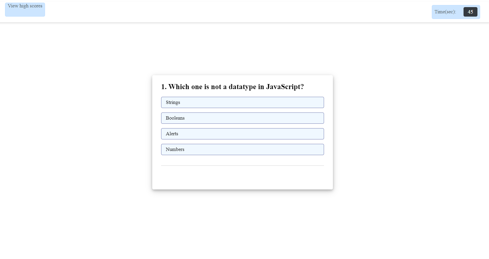

# JavaScript-Quiz-App

## The Repository
This repository contains a timid quiz web page that stores high scores that will help students gauge progress compared to peers .

### The Purpose
The Quiz  application makes it easier for student gauge and learn JavaScript easily. This app runs in the browser, and features dynamically updated HTML and CSS powered by JavaScript code. It has a clean and polished user interface.

### How it Works
* Click the start button to generate the 5 questions. 
* You will be presented 4 choices for each question.
* The timer will count down from 60sec when you start the quiz.
* when you have answered the 5 question or time runs out you will be displayed a result page.
* On the result page you will be prompted to input you initals and save your score.
* you are able to check the high scores with the view high score link.

## Screenshot of deployed page:

## Link to deployed application:

The deployed application [JavaScript-Quiz-App](https://robel-codes.github.io/javascript-quiz-app/)

